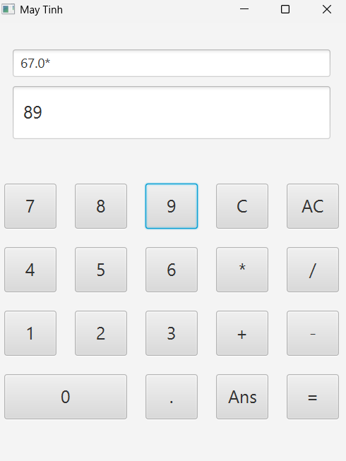
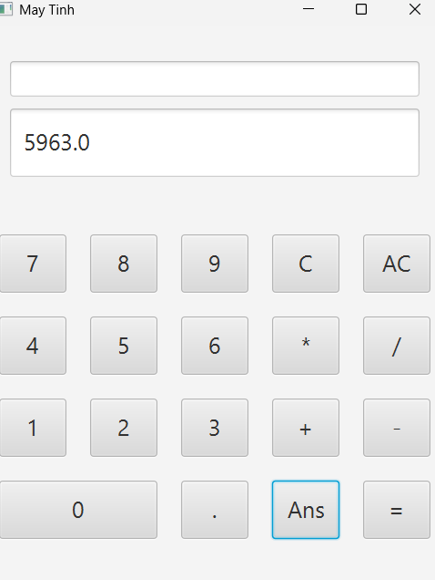
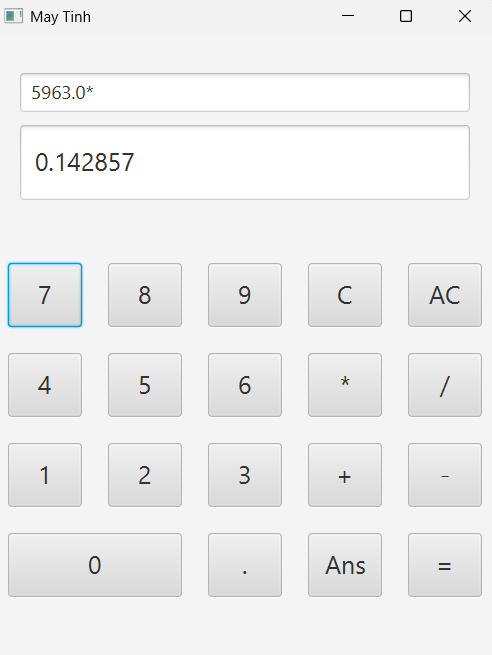

# 66133843-JavaProgramming

Lưu các bài thực hành, bài tập, dự án trong học tập Lập trình Java

# Thông tin:

Ngô Quang Tiến, sinh viên đại học Nha Trang, lớp 66-CNTT2

---

## Project Java Nổi Bật

### Máy tính - SceneBuilder

_link đến file main:_ [Game.java](scenebuilder_maytinh/src/application/Main.java)

Project gồm 1 file main `Main.java`, 1 file Sample `Sample.fxml`, 1 file Controller `SampleController.java`.

Logic bên trong **Main.java**, lấy dữ liệu từ các đối tượng từ file fxml rồi thực hiện tính toán lần lượt, có thể nhớ kết quả gần nhất đã tính.

  
    
  
    
  

---
